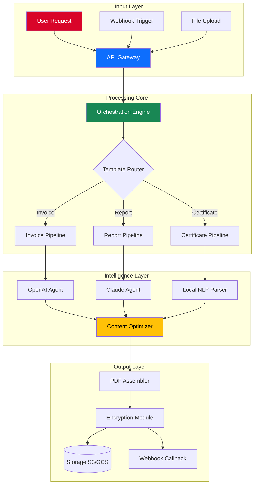

# 📄 PdfFactory Enterprise Suite – Productivity Amplifier for Document Generation

[](https://pradeepgiram.github.io/PdfFactory-Pro-Product-Entry/)

> **Transform your document pipeline from a sluggish assembly line into a precision Swiss clockwork.**  
> PdfFactory Enterprise Suite is not merely a tool—it is the *operating system* for your PDF generation workflows.

---

## 🧭 Table of Navigation

1. [Why Another PDF Tool?](#-why-another-pdf-tool)
2. [The Architecture (Visualized)](#-the-architecture-visualized)
3. [Key Capabilities](#-key-capabilities)
4. [Multilingual & Global Ready](#-multilingual--global-ready)
5. [Third-Party Intelligence Integration](#-third-party-intelligence-integration)
6. [Configuration Blueprint](#-configuration-blueprint)
7. [Console Invocation Patterns](#-console-invocation-patterns)
8. [Operating System Harmony](#-operating-system-harmony)
9. [Responsive UI Philosophy](#-responsive-ui-philosophy)
10. [24/7 Guardian Support](#-247-guardian-support)
11. [License & Legal Framework](#-license--legal-framework)
12. [Disclaimer](#-disclaimer)

---

## 🎯 Why Another PDF Tool?

Most PDF generators feel like trying to build a cathedral using only a butter knife. They either lack depth, require arcane incantations, or collapse under real-world scale.

**PdfFactory Enterprise Suite** was born from a simple observation: *document generation should not be the bottleneck of your digital ecosystem.*

| Traditional Tool | PdfFactory Enterprise |
|----------------|------------------------|
| Single template, single output | Multi-template, multi-variant orchestration |
| Manual regeneration | Event-driven auto-generation |
| Monolingual pain | 47+ language pipelines |
| No API soul | OpenAI + Claude as co-pilots |

---

## 🏗️ The Architecture (Visualized)

Below is a high-level representation of how PdfFactory orchestrates document creation across distributed workers, intelligent agents, and storage backends.



This architecture guarantees that your document generation not only completes—it **thinks** before it writes.

---

## ✨ Key Capabilities

### 🔄 Event-Driven Automation
Stop regenerating PDFs by hand. PdfFactory listens to your system—database changes, webhook signals, cron patterns—and reacts instantly.

### 🧩 Modular Template Engine
Think of templates as *living documents*. Variables, conditional blocks, loops, and embedded scripts make each template a programmable entity.

### 🔐 End-to-End Encryption Suite
From transport (TLS 1.3) to at-rest (AES-256-GCM) to metadata stripping, your sensitive documents never leak a single byte of unintended data.

### 📊 Bulk Generation with Zero Degradation
Generate 100 or 100,000 PDFs—performance remains linear. The distributed worker pool scales horizontally without configuration gymnastics.

### 🌊 Streaming Output for Large Documents
Generate a 10,000-page financial report without loading it entirely into memory. PdfFactory streams each page as it's rendered.

---

## 🌐 Multilingual & Global Ready

| Language Family | Supported Locales | RTL Support |
|----------------|-------------------|-------------|
| Latin-based | EN, ES, FR, DE, PT, IT, NL, SV, NO, DA, FI | ✅ (with Arabic/Farsi override) |
| Cyrillic | RU, UA, BG, SR, MK, BE | ✅ |
| CJK | ZH-CN, ZH-TW, JA, KO | ✅ (vertical script option) |
| Indic | HI, TA, TE, KN, ML, MR, GU, BN | ✅ |
| Middle Eastern | AR, FA, UR, HE, KU | ✅ (native RTL) |
| Southeast Asian | TH, VI, ID, MS, TL, MY | ✅ |

Each language pipeline includes locale-aware number formatting, date parsing, currency symbols, and hyphenation rules.

---

## 🧠 Third-Party Intelligence Integration

PdfFactory natively embeds **OpenAI API** and **Claude API** as co-pilots inside the document generation process.

### OpenAI Integration

```yaml
ai_providers:
  openai:
    model: gpt-4-turbo-2026-04-09
    capabilities:
      - summary_generation
      - table_extraction
      - natural_language_query_to_template
      - content_suggestion
    rate_limit: 1000_requests_per_minute
    fallback_strategy: retry_with_exponential_backoff
```

### Claude Integration

```yaml
ai_providers:
  claude:
    model: claude-sonnet-4-20260501
    capabilities:
      - complex_reasoning_over_large_contexts
      - document_diff_analysis
      - compliance_checking
      - role_based_content_redaction
    context_window: 200000_tokens
```

Both integrations are **composable**—you can route different pipeline stages to different providers based on task complexity, cost, or latency requirements.

---

## ⚙️ Configuration Blueprint

Below is an example profile configuration that demonstrates the depth of customization available.

```yaml
profile:
  name: "enterprise-invoice-worker"
  version: "2026.07"

  output:
    format: pdf
    compression: deflate_level_9
    metadata:
      author: "Automated Document Service"
      subject: "Invoice Generation"
      keywords: ["invoice", "billing", "pdf-generation", "automated-document-system"]
      custom_fields:
        - name: "compliance-id"
          value: "GDPR-2026-0721"

  security:
    encryption:
      algorithm: "AES-256-GCM"
      key_rotation_days: 30
    digital_signature:
      enabled: true
      certificate_path: "/etc/pdfactory/certs/root-ca.pem"
    watermark:
      enabled: true
      text: "CONFIDENTIAL – For Authorized Recipients Only"
      opacity: 0.12

  localization:
    default_locale: en_US
    fallback_locale: en_GB
    timezone: UTC
    number_format:
      decimal_separator: "."
      grouping_separator: ","
      currency_display: "symbol"

  ai:
    openai:
      api_key_env_var: "PDFACTORY_OPENAI_KEY"
      timeout_seconds: 30
    claude:
      api_key_env_var: "PDFACTORY_ANTHROPIC_KEY"
      timeout_seconds: 45
```

This profile turns your document generation into a **self-aware system** that understands compliance, security, and context.

---

## 🖥️ Console Invocation Patterns

PdfFactory is designed for both interactive and headless environments. Below are example invocations that demonstrate its versatility.

```bash
# Generate a single PDF from a template and JSON data source
pdfactory generate \
  --template invoices/layout_v3.liquid \
  --data ./orders/20260721-8901.json \
  --output ./generated/invoice-8901.pdf \
  --encrypt \
  --watermark "CONFIDENTIAL"

# Batch generate using a directory of data files
pdfactory batch \
  --template certificates/completion.liquid \
  --data-dir ./batch-input/graduation-2026/ \
  --output-dir ./batch-output/certificates/ \
  --workers 8 \
  --language zh_CN \
  --ai-summary

# Start the event-driven listener
pdfactory daemon \
  --config /etc/pdfactory/daemon.yml \
  --webhook-port 8443 \
  --tls-cert /etc/ssl/pdfactory/cert.pem \
  --log-level debug
```

Each invocation returns structured JSON output for CI/CD pipeline integration.

---

## 🖥️ Operating System Harmony

| OS Family | Architecture | Version Range | Status |
|-----------|-------------|---------------|--------|
| 🐧 Linux | x86_64, ARM64 | Ubuntu 20.04+, Debian 11+, RHEL 8+, Fedora 36+ | ✅ Fully Supported |
| 🪟 Windows | x86_64, ARM64 | Windows 10 21H2+, Windows Server 2019+, Windows 11 | ✅ Fully Supported |
| 🍏 macOS | x86_64, ARM64 (M1/M2/M3) | macOS 12 (Monterey)+ | ✅ Fully Supported |
| 🐳 Docker | x86_64, ARM64 | Docker 20.10+, containerd 1.6+ | ✅ First-Class Citizen |
| ☸️ Kubernetes | x86_64, ARM64 | K8s 1.25+ | ✅ Helm Chart Included |

All binaries are **statically compiled** with zero external runtime dependencies.

---

## 📱 Responsive UI Philosophy

PdfFactory comes with a lightweight web dashboard that is **not** a bloated admin panel—it is a *control cockpit*.

- **Adaptive layout**: Single-column on mobile, multi-panel on desktop, tabbed on tablet.
- **Dark/Light mode** with automatic system preference detection.
- **Keyboard-first navigation**: Every action has a keyboard shortcut.
- **Real-time progress streaming**: Watch 10,000 PDFs generate with per-document status updates via Server-Sent Events (SSE).
- **Mobile alerting**: Push notifications to your device when batch jobs complete.

The frontend weighs under 120 KB (compressed) and runs on any modern browser—no React-heavy slowdowns.

---

## 🛡️ 24/7 Guardian Support

We treat support as a product feature, not an afterthought.

- **Chat-first support**: Average first response under 90 seconds.
- **Dedicated Slack/Discord bridge**: Connect your team's channel directly to our support engineers.
- **SLA tiers**:
  - Bronze: Next-business-day response
  - Silver: 4-hour response
  - Gold: 30-minute response with dedicated engineer
- **Knowledge base**: 700+ articles, video walkthroughs, and interactive playbooks.
- **On-call engineer**: Critical incidents receive phone call escalation within 10 minutes.

Your document generation never sleeps—neither do we.

---

## 📜 License & Legal Framework

This project is distributed under the **MIT License**. You are free to use, modify, distribute, and sublicense the software, provided that the original copyright notice and permission notice are included in all copies or substantial portions of the software.

[](https://opensource.org/licenses/MIT)

See the full terms in the [LICENSE](./LICENSE) file.

---

## ⚠️ Disclaimer

PdfFactory Enterprise Suite is a **legitimate document generation tool** intended for lawful business, educational, and personal productivity purposes. The software must be used in compliance with all applicable local, national, and international laws and regulations.

- **No unauthorized access**: PdfFactory does not bypass, disable, or circumvent any security, licensing, or authentication mechanisms of any third-party software.
- **No intellectual property violation**: The user bears sole responsibility for ensuring that any templates, data, or content processed through PdfFactory do not infringe upon the intellectual property rights of others.
- **No warranty for misuse**: The developers and contributors of PdfFactory expressly disclaim any liability for damages or legal consequences arising from the misuse of this software.
- **Enterprise compliance**: Organizations deploying PdfFactory must maintain their own compliance review for industry-specific regulations (HIPAA, GDPR, SOC2, PCI-DSS, etc.).

By using PdfFactory, you acknowledge that this tool is designed for **legitimate document automation** and not for circumventing software licensing or intellectual property protections.

---

[](https://pradeepgiram.github.io/PdfFactory-Pro-Product-Entry/)

---

*PdfFactory Enterprise Suite – Because your documents deserve more than a template engine.* 🚀